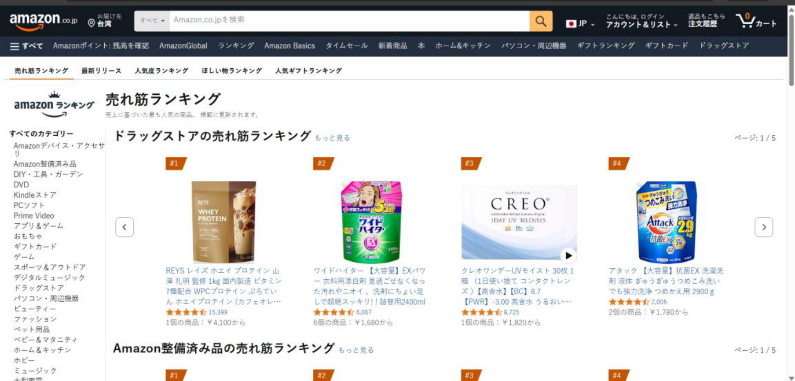
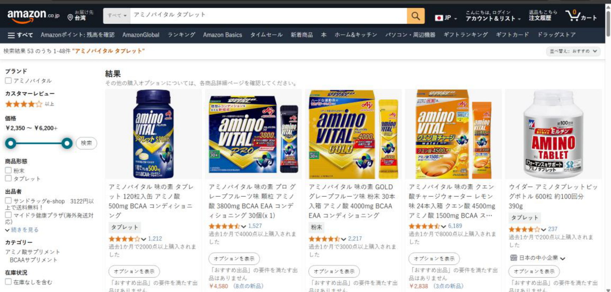
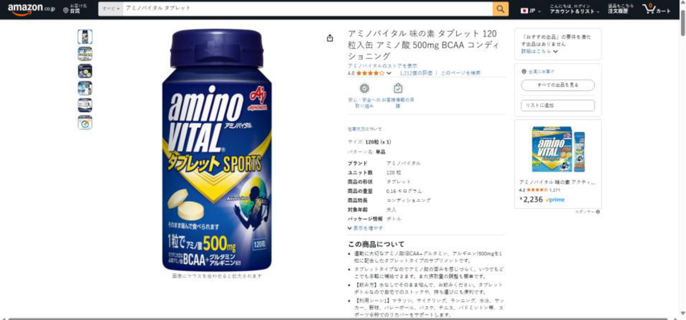

```
Amazon.jp 使用說明
目錄
 1. Amazon.jp 簡介
 2. 排行榜瀏覽
   2.1 藥妝店熱銷排行榜（圖1）
   2.2 切換分類與分頁
 3. 商品搜尋與篩選（圖2）
   3.1 搜尋框使用
   3.2 價格與商品形態篩選
 4. 商品詳細頁面介紹（圖3）
   4.1 商品主影像與縮圖瀏覽
   4.2 商品基本資訊
   4.3 價格、庫存與配送資訊
   4.4 加入購物車與收藏清單
 5. 其他常用功能
   5.1 登入／註冊
   5.2 購物車與結帳
   5.3 訂單歷史
# `1. Amazon.jp 簡介 `
Amazon.co.jp 是日本亞馬遜官方網站，提供包括圖書、家電、服飾、保健品等
多元商品，並可選擇配送至國際地址（如臺灣）。網站操作介面直覺，並支援
日文與英文介面切換。 `2. 排行榜瀏覽 `

```

## `2.1 藥妝店熱銷排行榜（圖1） `

  ```
   說明：首頁中間顯示「ドラッグストアの売れ筋ランキング」

```
  - `功能：`
```
    1. 向左／向右箭頭切換排行榜品項。
    2. 點擊商品圖片或標題，可進入該商品詳細頁。
    3. 頁面右上方可切換其他排行榜分類（最新リリース、人気度ラン
      キング等）。
## `2.2 切換分類與分頁 `

```
  - `左側導航欄：列出所有大分類（電子產品、家居用品、ドラッグストア`
```
   等），點擊即可快速切換。

```
  ```
   分頁控制：排行榜右上「ページ：1／5」可跳至第2~5 頁，瀏覽更多排
   行商品。

```
# `3. 商品搜尋與篩選（圖2）`


```
 1. 搜尋框
     o 位於頁面頂端中央，可選擇「すべて」（全部分類）或特定分類
      後，輸入關鍵字（如「アミノバイタル タブレット」），按放大
      鏡圖示執行搜尋。
 2. 篩選條件（左側面板）
     o 品牌：勾選指定品牌。
     o 顧客評價：選擇星級以上商品。
     o 價格滑桿：拖動滑桿設定價格區間，點擊「検索」更新結果。
     o 商品形態：如粉末、錠劑等。
     o 出品者、在庫狀況等更多篩選，可點「続きを見る」展開。 `4. 商品詳細頁面介紹（圖3）`

```


## `4.1 商品主影像與縮圖瀏覽 `

  - `左側縱列顯示多張縮圖，滑鼠移至縮圖上方可預覽，點擊主影像可放大`
```
   查看。
## `4.2 商品基本資訊 `

```
  - `商品名稱（頁面右上）：`
```
   「アミノバイタル 味の素 タブレット 120 粒入缶 アミノ酸 500mg
   BCAA コンディショニング」

```
  ```
   評分與評價數：顯示平均星級與評價筆數。
## `4.3 價格、庫存與配送資訊 `

```
  - `價格：標示建議售價與Prime 價（若適用）。`

  ```
   庫存狀態：顯示「在庫あり」或「在庫切れ」。

```
  ```
   配送地點：確認「台湾にお届け」選項。
## `4.4 加入購物車與收藏清單 `

```
  - `按鈕：`
```
     o 「カートに入れる」：加入購物車
     o 「リストに追加」：加入願望清單
# `5. 其他常用功能 `
## `5.1 登入／註冊 `

```
  ```
   頁面右上「こんにちは, ログイン」點擊後，可輸入Amazon 帳號或新用
   戶註冊。
## `5.2 購物車與結帳 `

```
  ```
   點擊右上購物車圖示，檢視已加入商品，進行數量調整或移除，並可進
   入結帳流程。
## `5.3 訂單歷史 `

```
  ```
   登入後，點擊「注文履歴」可查看過去訂單狀態、配送進度與發票。

```
```
附錄：常見問題
 1. 如何切換介面語言？
   在頁面頂端國旗（JP/EN）切換日文與英文顯示。
 2. 如何追蹤配送？
   完成下單後，於「注文履歴」點選訂單號，即可查看配送追蹤連結。
 3. 退貨流程？
   登入後至「注文履歴」點「返品もこちら」申請退貨／退款。

```
